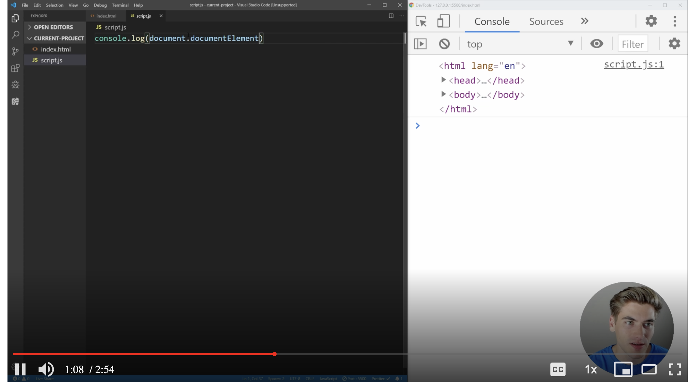

# YouTube Video Player Clone

A fully functional video player built with vanilla HTML, CSS, and JavaScript that replicates the core features of YouTube's video player interface. This project was created as a learning exercise following the tutorial from [Web Dev Simplified](https://www.youtube.com/watch?v=ZeNyjnneq_w)



## 🎥 Features

### Core Video Controls
- **Play/Pause**: Click the video or play button, or press `Space` or `K`
- **Volume Control**: Adjustable volume slider with mute functionality
- **Fullscreen**: Toggle fullscreen mode with the button or press `F`
- **Theater Mode**: Switch to theater layout with the button or press `T`
- **Mini Player**: Enter picture-in-picture mode with the button or press `I`
- **Mute**: Toggle mute with the button or press `M`
- **Captions**: Toggle subtitles with the button or press `C`
- **Playback Speed**: Adjust video speed (0.5x to 2x) with the speed button

### Timeline & Navigation
- **Timeline Scrubbing**: Click and drag on the timeline to seek
- **Preview Thumbnails**: Hover over timeline to see video previews
- **Skip Forward/Backward**: Press `L` or `→` to skip 5 seconds forward, `J` or `←` to skip 5 seconds backward
- **Time Display**: Current time and total duration shown

### User Experience
- **Auto-hiding Controls**: Video controls fade out when not in use
- **Keyboard Shortcuts**: Full keyboard navigation support
- **Responsive Design**: Adapts to different screen sizes
- **Smooth Animations**: CSS transitions for polished interactions
- **Volume Level Indicators**: Visual feedback for volume states (high/low/muted)
- **Scrubbing Preview**: See video thumbnails while scrubbing through timeline

### Visual Design
- **YouTube-like Interface**: Familiar controls and layout
- **Hover Effects**: Interactive button states
- **Gradient Overlay**: Semi-transparent gradient behind controls
- **SVG Icons**: Scalable vector graphics for crisp display
- **Preview Images**: Thumbnail previews during timeline scrubbing

## 🚀 Getting Started

### Prerequisites
- A modern web browser (Chrome, Firefox, Safari, Edge)
- No additional dependencies required!

### Installation
1. Clone the repository:
   ```bash
   git clone https://github.com/banghuazhao/youtube-video-player-clone.git
   cd youtube-video-player-clone
   ```

2. Open `index.html` in your web browser

## 📁 Project Structure

```
youtube-video-player-clone/
├── index.html          # Main HTML structure
├── styles.css          # All styling and animations
├── script.js           # JavaScript functionality
└── assets/
    ├── Video.mp4       # Sample video file
    ├── subtitles.vtt   # Subtitles file
    └── previewImgs/    # Thumbnail previews
        ├── preview1.jpg
        ├── preview2.jpg
        └── ...
```

## 🎮 Controls

### Mouse/Touch
- **Click video**: Play/Pause
- **Play/Pause button**: Toggle playback
- **Volume slider**: Adjust volume
- **Mute button**: Toggle mute
- **Fullscreen button**: Enter/exit fullscreen
- **Theater button**: Toggle theater mode
- **Mini player button**: Enter picture-in-picture
- **Captions button**: Toggle subtitles
- **Speed button**: Change playback speed
- **Timeline**: Click and drag to seek through video
- **Timeline hover**: See video preview thumbnails

### Keyboard Shortcuts
| Key | Action |
|-----|--------|
| `Space` or `K` | Play/Pause |
| `F` | Toggle Fullscreen |
| `T` | Toggle Theater Mode |
| `I` | Toggle Mini Player |
| `M` | Toggle Mute |
| `C` | Toggle Captions |
| `L` or `→` | Skip 5 seconds forward |
| `J` or `←` | Skip 5 seconds backward |

## 🛠️ Technical Implementation

### HTML Structure
- Semantic HTML5 elements
- Custom data attributes for state management
- SVG icons for crisp scaling

### CSS Features
- **CSS Grid & Flexbox**: Modern layout techniques
- **CSS Custom Properties**: Reusable design tokens
- **Pseudo-elements**: Decorative overlays and effects
- **Media Queries**: Responsive design
- **Transitions**: Smooth state changes

### JavaScript Features
- **Event Listeners**: Comprehensive user interaction handling
- **DOM Manipulation**: Dynamic UI updates
- **HTML5 Video API**: Native video controls
- **Fullscreen API**: Browser fullscreen functionality
- **Picture-in-Picture API**: Mini player mode

## 🎯 Learning Outcomes

This project demonstrates:
- **Modern JavaScript**: ES6+ features and DOM manipulation
- **CSS Mastery**: Advanced styling techniques and animations
- **HTML5 APIs**: Video, Fullscreen, and Picture-in-Picture APIs
- **User Experience**: Intuitive controls and feedback
- **Responsive Design**: Cross-device compatibility

## 📺 Tutorial Reference

This project was built following the tutorial:
**[How To Create The YouTube Video Player](https://www.youtube.com/watch?v=ZeNyjnneq_w)** by Web Dev Simplified

The tutorial covers:
- Building a complete video player from scratch
- Implementing all major YouTube player features
- Modern web development techniques
- Best practices for user interface design

## 🤝 Contributing

Feel free to submit issues and enhancement requests!

## 📄 License

This project is open source and available under the [MIT License](LICENSE).

## 🙏 Acknowledgments

- **Web Dev Simplified** for the excellent tutorial
- **YouTube** for the original interface design inspiration
- The open source community for various tools and resources

---

**Note**: This is a **completed** learning project created for educational purposes. The video player is fully functional and demonstrates modern web development techniques using vanilla HTML, CSS, and JavaScript. All features have been implemented and tested.
